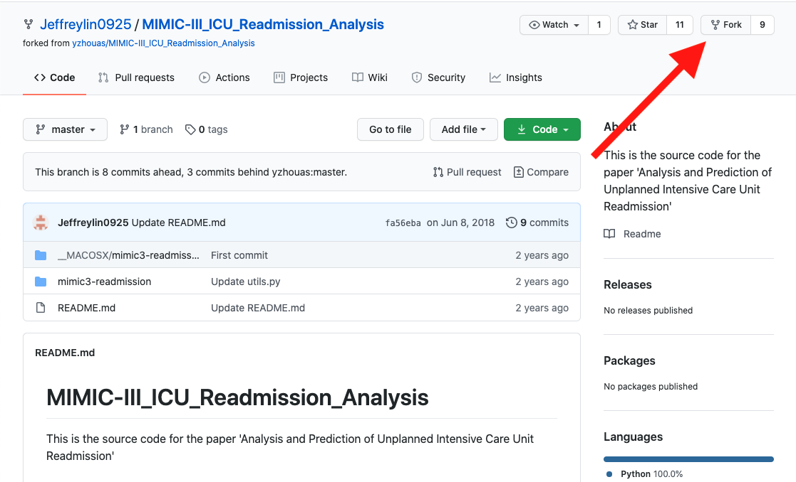
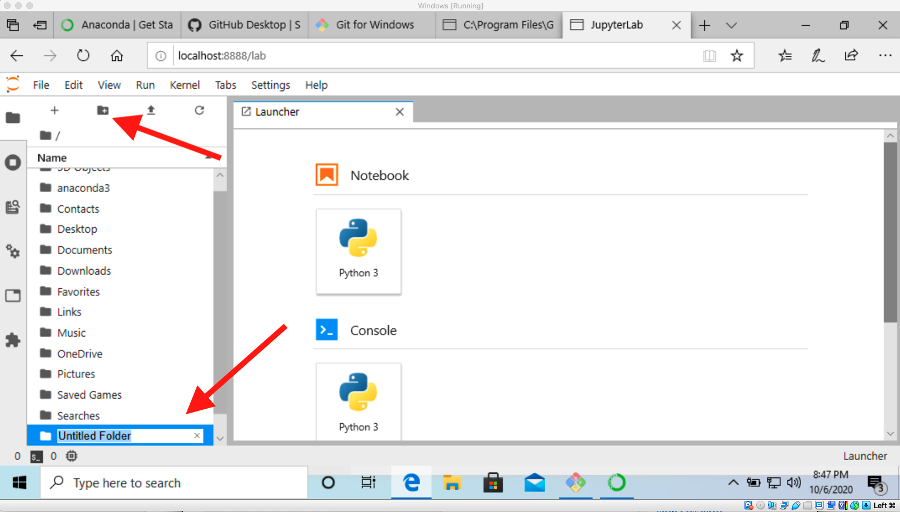
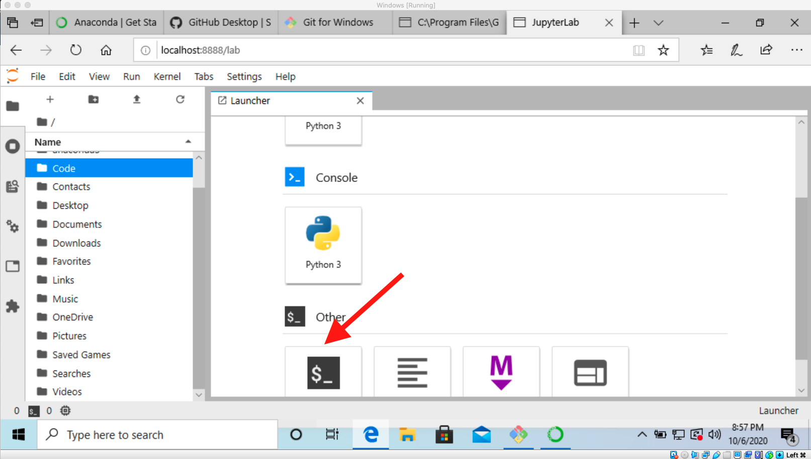

## Working with a GitHub repository

In an excellent reproducible science method, the authors of the paper provide a [GitHub repository](https://github.com/Jeffreylin0925/MIMIC-III_ICU_Readmission_Analysis) with the code they used in the paper.

We could download or copy this code directly to our computers, but instead we are going to first create our own __fork__ of this repository. A __fork__ is a copy of the repository that we own but is still connected to the original repository. This means that a) we can make our own changes to the repository, b) we can share these changes with the owner of the original repository (if we want to and if they want to receive them), and c) we can update our own copy with any changes made to the original repository (if we want these changes).

We make a fork simply by clicking on the fork button at the top of the page:

Once this process is done, we will be redirected to a new webpage that is our own copy of the repository on GitHub. If you look at the top left of the page you should see that the repository is now in your account and that it is forked from Jeffreylin0925.

## Clone the Repository

Now that we have our own copy of the repository, we need to get it onto our own computer. Since I'm assuming most of you are not overly familiar with the command line tools of your computer, I'm going to do everything with the JupyterLab environment we worked with in June/July. Alternative instructions are provided later.

### Launch JupyterLab

1. Open Anaconda-Navigator
    1. On Windows this is launched from the Start menu
    1. On Macs this can be launched from LaunchPad
1. Click on the "Launch" button for JupyterLab

.

This will open your default web browser to the localhost port running JupyterLab.

### Create a `Code` Directory

We need some place to copy the repository to on our computer. By convention is to have a directory named `Code` in my home directory where I put all (almost) of my coding projects. If you want a different name, feel free to change `Code` to your name of choice.

1. In JupyterLab click on the create a folder/directory icon and then rename the Untitled Folder "Code"

1. From the JupyterLab Launcher click on the bash icon to launch a bash shell (terminal).

1. In the bash shell type `cd Code` to change directory to the new folder/directory we created.
1. On the webpage with your fork of the repository, click on the green Code button to bring up the Clone address.
    1. Make sure you select `HTTPS` rather than `SSH` or `GitHub CLI`
    1. Click on the clipboard icon to copy the address
1. In the JupyterLab bash shell, type `git clone ` and then paste the address you copied. You should se some messages about cloning into, "receiving objects" and "resolving deltas". When everything is done, you should have a copy of the code on your computer.
