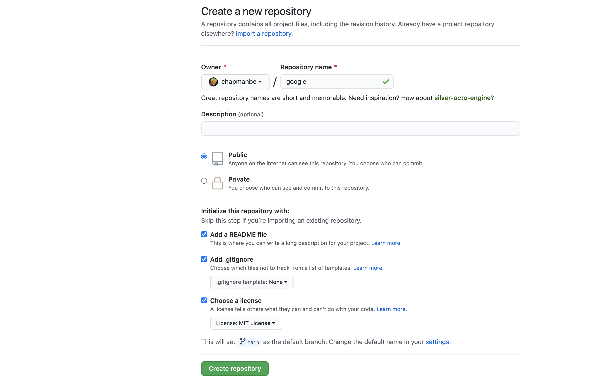

# Creating a Git Repository

Since we are going to create code to interact with resources on GoogleCloud, let's create a new repository for a GoogleCloud project.

On GitHub go to your home page.


Click on the link for "Repositories"


Pick a name, feel free to make your repository private rather than public if you would like, select "Add a README file", select "Add .gitignore" and select Python as the template. Finally, you should choose a license. I chose the MIT License which is the most permissive.



Once the repository is created, we can follow the same steps we took for the MIMIC III code repository.

### Create an `environment.yml` file

We can start by copying our previous `environment.yml` file and editing it. The main thing we need to add is `google-cloud-storage` for connecting to Google and `ibis-framework[postgres,bigquery,sqlite,mysql]`

```Yaml
name: google
channels:
  - conda-forge
dependencies:
  - python=3.7
  - pandas
  - keras
  - scikit-learn
  - pip
  - seaborn
  - jupyterlab
  - pip:
    - plaidml
    - google-cloud-
    - google-auth-oauthlib
    - ibis-framework[postgres,bigquery,sqlite,mysql]
```

```The first 1 TB per month of BigQuery queries are free. See the BigQuery pricing documentation for more details about on-demand and flat-rate pricing. BigQuery also offers controls to limit your costs.
```


### Creating a GCP Project

The materials I am presenting are based on these two Google documents:

- [Getting started with authentication](https://cloud.google.com/docs/authentication/end-user)
- [Query BigQuery With Python Using Ibis](https://cloud.google.com/community/tutorials/bigquery-ibis)

There are multiple ways of authenticating an application with Google. I tried several of them, but the only one I could get working was the end-user authentication with `OAuth`.

I created a Google Cloud Platform project named `mimic4-bq`. (I already have billing set up for other projects and Google didn't explicitly ask me anything about billing.)

I'm following the instructions described [here](https://cloud.google.com/docs/authentication/end-user#end_user_authentication_example).

Starting from this page

1. Select a project
1. Enable the BigQuery API


After this, scroll down on the page to the section "Creating your client credentials" and click on the link "OAuth consent screen."


Click on the "Credentials" link on the left menu.


On the new page click on "+ Create Credentials".


Select "OAuth client ID" as the type.


Select "Desktop app" as the "Application type" and give your app some reasonable name then click on "Create"


Download the credentials and put the file in a safe location. I put mine in "/Users/brian/.google"


