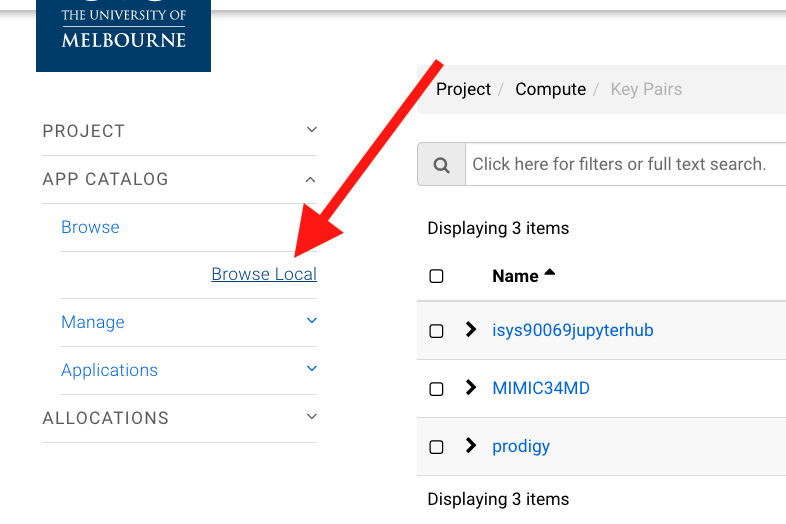

# Setting Up a Jupyter Notebook/Lab on MRC

The Melbourne Research Cloud provides instructions (sort of) for creating a Jupyter notebook server. From my initial exploration, it does not seem to support Jupyterlab yet. You can find their instructions [here](https://docs.cloud.unimelb.edu.au/guides/application_rstudio/), although they are setting up an R-Studio server.

The default allocation provided to you as a student (and me as well) is fairly spartan and we are not allocated extra disk space (so we can't create a persistent volume).

## [Login to the Melbourne Research Cloud](https://dashboard.cloud.unimelb.edu.au/auth/login/?next=/)

Melbourne Research Cloud is part of a larger computing resource serving Australian universities. You need to select the University of Melbourne from the list of institutions, agree to the terms of service, and then use your university credentials to login.

## [Create a key pair](https://docs.cloud.unimelb.edu.au/training/first_instance/#create_keypair)

We will create an ssh key pair. This will allow us to securely connect to our instance with ssh.

1. On the left menu click on "Compute"->"Key  Pairs".
1. On the new web page click on "+Create Key Pair" at the top of the page.
1. In the pop up window, give the key a name that is meaningful to you (e.g. MIMIC) and select "SSH Key" as the Key Type.

Once you've created the key pair, the private half of the pair will automatically be downloaded to your computer. The file will have the name of your key pair (e.g. MIMIC34MD) and will end in `.pem`. Either move this file to a standard location or remember where it is (likely "Downloads"). On my Mac I put these files in the `.ssh` directory. (Note that by default "dot files" are not shown in Finder.)

## Create a Jupyter Notebook Server

Now that we have the key-pair created, we will create the Jupyter notebook server. The Melbourne Research Cloud has a formula for creating these.

- At the bottom of the left menu click on "APP CATALOG", then "Browse" and "Browse Local".

- In the filter window type in "jupyter" to find the Jupyter Notebook App.

- Click on "Quick Deploy"

This creates a popup window where we have to select __Instance flavor__ that we will use. You may not have the same choices that I have. We have to be sure to select the flavor that fits in our allocation (i.e. 1-2 CPUs and <8 GBytes of RAM).

In the video I select `uom.general.2c8g`. If this is not available, you will probably have to select `m3.small`.

- Select the __Key pair__ you created.
- Select `melbourne-qh2-uom` for the __Availability zone__
- Click on "Next". This will create a configuration popup window.
- Provide a __Host name__ meaningful to you.

- Click on "Next" and then since we do not have a volume to connect click on "Next" again.
- On the popup page requesting a username and password, select any username you would like (e.g. "brian"). You need to be __careful__ with the password! The connection to the notebook will __not__ be encrypted so do not use a password you use elsewhere. To reduce your risk, use the [university's VPN](https://studentit.unimelb.edu.au/wireless-vpn/vpn) when connecting to the server.

[Here is a video](https://youtu.be/Rkkqv-cXhIw) of me going through these steps.
